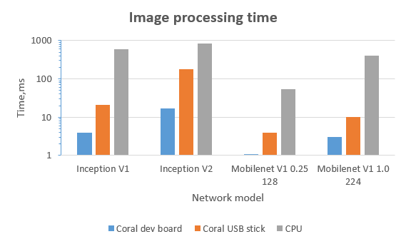
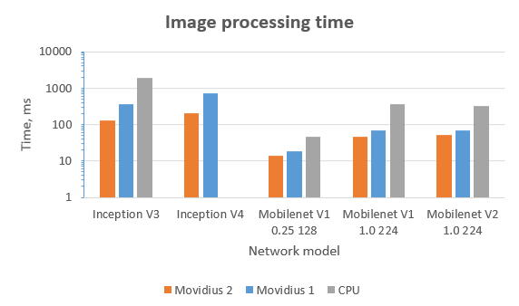
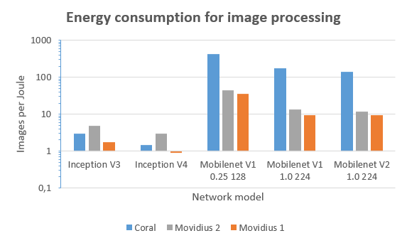

# Coral Evaluation 

## Experiment objectives
Google announced Beta version of their Coral AI device a month ago.  We had a possibility to evaluate both implementations - USB stick and dev board. We wanted to measure performance gain of Coral usage instead of Raspberry Pi's CPU for neural networks calculations as well as to measure the same performance gain for Intel's Movidius 1 and Movidius 2 devices when the same neural networks were executed.
## Obtaining internal neural network representation
The main problem to be solved is that Movidius and Coral use different internal representations of the networks. From the other point of view, Coral is in beta and supports only several NN architectures. For evaluation we selected Inception V1, Inception V2, Inception V3, Inception V4, Mobilenet V1 0.25 128, Mobilenet V1 1.0 224, Mobilenet V2 1.0 224 models that are hosted on [TensorFlow Lite site](https://www.tensorflow.org/lite/guide/hosted_models/) .

Quantized model variants were downloaded for execution on Coral device. Corresponding .tflite network files were compiled later into the internal network representations using [Edge TPU Model Compiler](https://coral.withgoogle.com/web-compiler/). 

Both TensorFlow Lite neural network file and compiled for Coral neural network file have the same extension - .tflite. However, when TensorFlow Lite neural network file is uploaded instead of the compiled one for Coral neural network file, we have the performance degradation due to the code execution on [CPU](https://coral.withgoogle.com/static/images/compile-tflite-to-edgetpu.png). No error messages are generated. 

Floating point model variants were downloaded for execution on Movidius devices. Network descriptions from .pb files were converted into the corresponding .bin and .xml files of the internal representation using model optimizer from openVINO 2019 R1 distribution. For conversion the following command line parameters were used:
`--input input`
`--input_shape [1,HEIGHT,WIDTH,3]`
Where HEIGHT and WIDTH are the height and width of the input images for which the model was trained.

We also tried to upload several network models into Coral simultaneously and found out that starting from the second one they were executed on  [CPU](https://coral.withgoogle.com/static/images/compile-tflite-to-edgetpu.png) ,too. 

Movidius allows executing of the several neural networks simultaneously on a single stick as well as using of batch data processing.   

## Performance measuring

Raspberry Pi 3+ was selected as a platform for Coral and Movidius evaluation. For chip performance measurement, we used the above mentioned  TensorFlow and TensorFlow Lite implementations of Inception V1, Inception V2, Inception V3, Inception V4, Mobilenet V1 0.25 128, Mobilenet V1 1.0 224, Mobilenet V2 1.0 224 networks. Test images were loaded to the stick for classification and measuring of the image processing speed. 20 test images were used for experiment with 50 cycles run for data collection. Results are provided in the Table 2.

We also made the second experiment for Coral on dev board to avoid USB2 bias on the device speed (Raspberry Pi 3 B+ has only USB2, when Coral USB stick was designed for USB3). Performance increased in 3-10 times. Same networks were executed on Raspberry Pi's CPU for comparison. Details are shown in Table 1 below, corresponding visualization in Figure 1 and 2.

*Table 2. Results of performance measuring.*

<table>
	<tr>
		<td rowspan="4">Network</td>
		<td colspan="6">Mean image processing time, sec</td>
	</tr>
	<tr>		
        <td colspan="3">Quantized Network</td>
		<td colspan="3">Floating Point Network</td>		
	</tr>
	<tr>		
        <td>Coral  Dev board</td>
		<td>Coral USB stick</td>
		<td>CPU</td>
		<td>Movidius 1</td>
		<td>Movidius 2</td>
		<td>CPU</td>
	</tr>
    <tr>		
        <td>INT8</td>
		<td>INT8</td>
		<td>INT8</td>
		<td>FP16</td>
		<td>FP16</td>
		<td>FP16</td>
	</tr>
	<tr>
        <td>Inception V1</td>
		<td>0.004</td>        
        <td>0.021</td>        
        <td>0.591</td> 
        <td>note2</td>
        <td>note2</td>
        <td>note2</td>
	</tr>
	<tr>
		<td>Inception V2</td>
		<td>0.017</td>        
        <td>0.178</td>        
        <td>0.835</td> 
        <td>note2</td>
        <td>note2</td>
        <td>note2</td>
	</tr>
	<tr>
		<td>Inception V3</td>
		<td>0.052</td>        
        <td>0.590</td>        
        <td>note1</td>
        <td>0.359</td>
        <td>0.126</td>
        <td>1.897</td>        
	</tr>
	<tr>
		<td>Inception V4</td>
		<td>0.102</td>        
        <td>1.184</td>
        <td>note1</td>
        <td>0.705</td>
        <td>0.206</td>
        <td>note3</td>        
	</tr>
	<tr>
		<td>Mobilenet V1 0.25 128</td>
		<td>0.001</td>        
        <td>0.004</td>
        <td>0.054</td>
        <td>0.018</td>
        <td>0.014</td>
        <td>0.046</td>
        </tr>
	<tr>
		<td>Mobilenet V1 1.0 224</td>
		<td>0.003</td>
        <td>0.010</td>
        <td>0.411</td>
        <td>0.068</td>
        <td>0.047</td>
        <td>0.370</td>
        </tr>
	<tr>
		<td>Mobilenet V2 1.0 224</td>
		<td>0.003</td>        
        <td>0.012</td>
        <td>note1</td>
        <td>0.068</td>
        <td>0.052</td>
        <td>0.323</td>        
	</tr>
</table>

Notes 

1 - Errors during execution network on CPU

2 - Floating point network variant is absent on  [TensorFlow Lite site](https://www.tensorflow.org/lite/guide/hosted_models/) 

3 - Memory allocation errors during execution on CPU

*Figure 1. Image processing time comparison for quantized networks models executed on Coral dev board, Coral USB stick and CPU.*

*Figure 2.  Image processing time comparison for floating point network models executed on  Movidius 1, Movidius 2  and CPU .*

## Power consumption
We used XTARs USB Detector to measure the power consumption during the computations. Measurements were made for Coral USB skick and Movidius 1 only, because it was impossible to measure Coral current  consumption on Dev board without changes in the board design. Results are shown in Table2. We also made computations of energy consumption in terms of Images per Joule (see Figure 3).

*Table 2. Power consumption of Coral USB stick and Movidius 1.*

| Device     |  U,B |  I,A |
| :--------- | ---: | ---: |
| Coral      | 5.26 | 0.11 |
| Movidius 1 | 5.22 | 0.30 |
| Movidius 2 | 5.19 | 0.31 |

*Figure 3.   Energy consumption in Images per Joule for Coral USB stick, Movidius 1 and Movidius 2.*

## Conclusions

According to the measurements results Coral USB stick is about 5 - 28 times faster than Raspberry Pi's CPU. Coral dev board is 50 - 145 times faster than Raspberry Pi's CPU and about 3-10 times faster than Coral USB stick. On the other hand, Movidius 1 is 3-6 times faster than Raspberry Pi's CPU, Movidius 2 is 3-15 times faster than Raspberry Pi's CPU and up to 3 times faster than Movidius 1.

Coral USB stick can process 2-18 times more images per Joule of used energy than Movidius 1 or Movidius 2.

