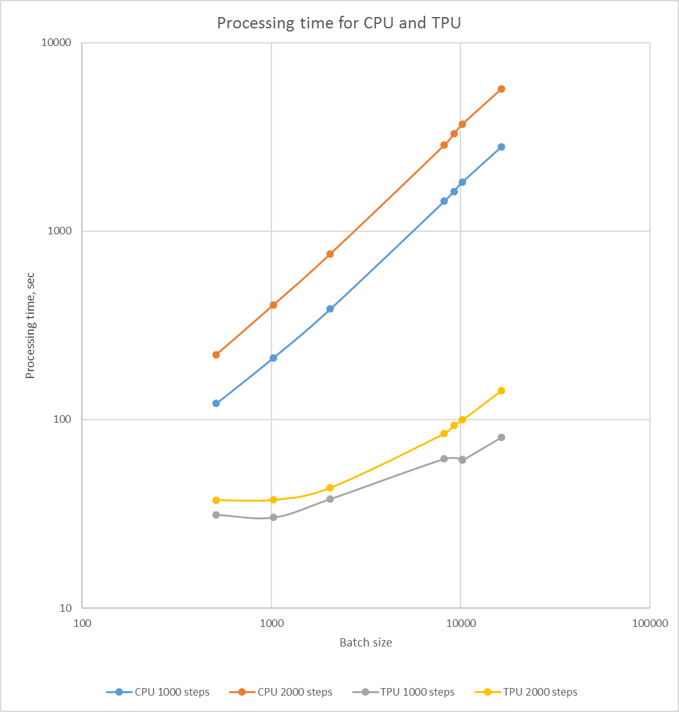
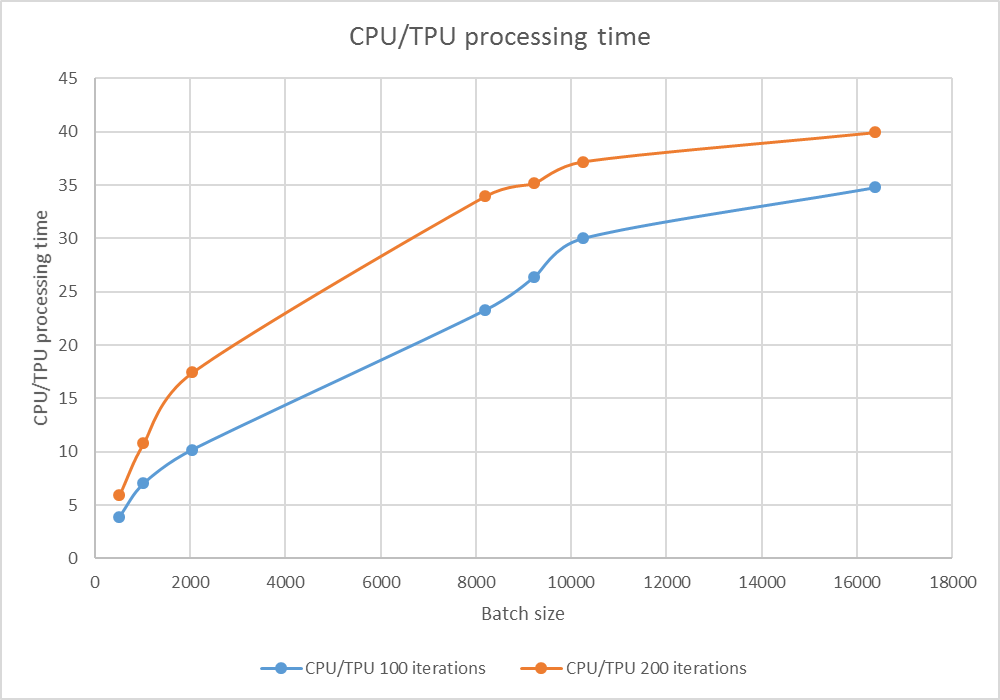
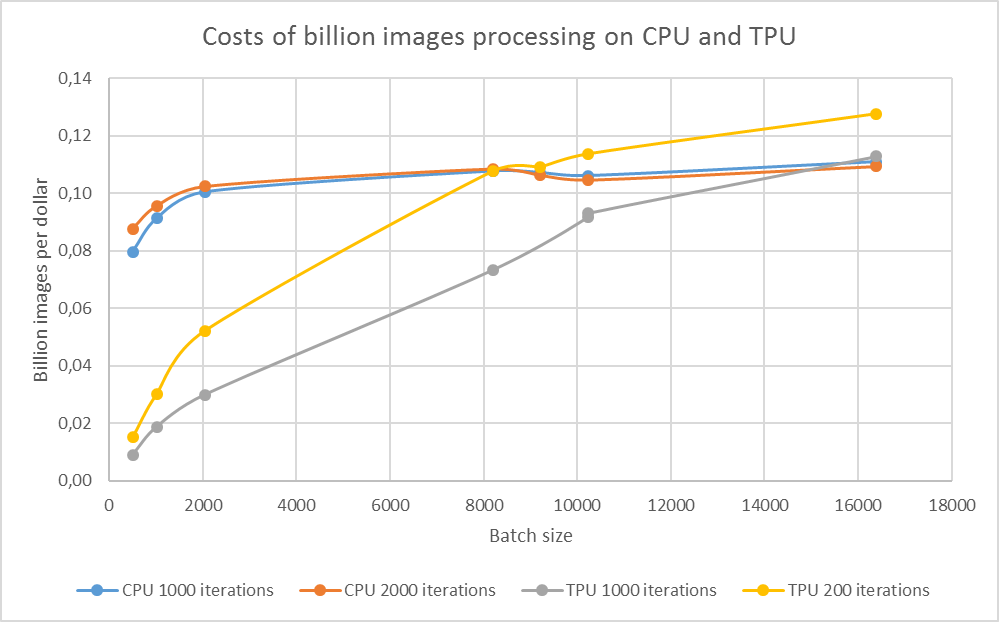

# Google TPU Performance

## Executive summary

The mission of the given research is to continue our [FPGA](README.md) and [Movidius](README-MOVIDIUS.md) performance investigation. 
This year Google gave a commercial access to its Tensor Processing Unit (TPU) and we decided to make similar performance experiments on it. 

Our experiments showed that TPU was 5-40 times faster than CPU, 
especially better performance was noticed on big batch sizes (164,000 images) of input data. 
However, at the same time processing costs for TPU are also cheaper for batch sizes starting from 10,000 images. 

So, we recommend to use TPU only for training on big amount of data. 
And sufficiently big portions of input data (batches) should be used for training to save costs. 
Predict functionality is still running on CPU, according to the latest Google's Tensor Flow documentation. 

## Experiment design

First idea was to compare TPU usage for prediction with FPGA and Movidius. 
We needed a tensor flow pre-trained network for that. 
Unfortunately, all the pre-trained networks use low level TF interfaces, while TPU works only with high level interfaces. 
After several attempts the way to use the pre-trained network on low level interfaces with high level Estimation interface was found. 
But still it was not the work with TPUEstimator interface. 
Deep investigation of Tensor Flow documentation showed that TPUEstimator.predict method was still experimental and was always executed on CPU.

So, for the next experiment we used MNIST training example and measured time of training network for different batch sizes (512, 1024, 2048, 8192, 9216, 10240 and 16384 images) 
and for different number of iterations (1000 and 2000 iterations). We used $6.5/h price for TPU and $0.19/h price for used VM for costs estimation.

## Results

Processing time for CPU and TPU for different batch sizes and quantity of iterations.

Comparison of CPU and TPU processing time.

From the financial point of view, TPU usage is recommended, starting from the batch size over 10000 images. 
For the smaller batch sizes, image processing costs are cheaper for CPU.

Images per dollar vs batch size and quantity of iterations 

## Conclusions

Following the results of the performed experiments TPU is 5 times faster than CPU on batches of small sizes (512 images)
and up to 40 times faster on batches of big sizes (164000 images).

Hence, it is more expedient to use TPU while working with big amounts of data for training in terms of saving money. 
Whereas CPU remains for running Predict functionality.

    
